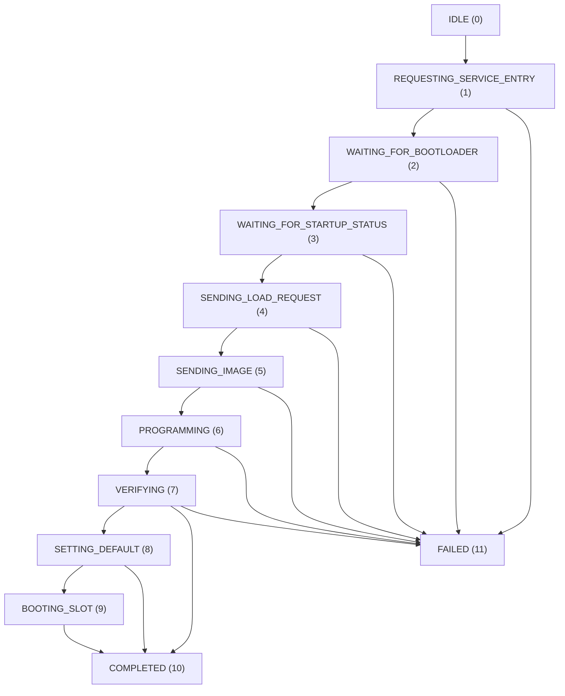

## Firmware Management

Bootloader-equipped instruments store runtime firmware in flash memory slots managed by an on-device service bootloader. The SDK provides a field-update workflow for loading images, managing slots and booting runtime firmware. Original Zynq without a bootloader uses direct runtime attachment and does not acquire these service features simply because it uses the same API.

Ordinary measurement does not require this workflow: native `connect_runtime` can boot an already-valid image when needed. Use field update when you intend to change firmware. Preview.8 supplies the service tools; obtain the image separately for the exact instrument/application.

### [Firmware image format](1_4_firmware.md#firmware-image-format)

Firmware images use a strict filename convention:

```
<NAME>_<VERSION>.bin
```

| Component | Format | Constraints | Example |
|---|---|---|---|
| `<NAME>` | ASCII alphanumeric | Exactly 4 characters, `isalnum()` | `BOOT` |
| `<VERSION>` | Decimal unsigned integer | 0–4294967295 (`uint32`) | `001` |
| Extension | `.bin` | Required | `.bin` |

**Valid example:** `BOOT_001.bin` — name `BOOT`, version `1`.

The image loader validates this convention before loading a file. The example's `image_metadata_from_filename()` function extracts and validates the name and version from the filename stem by splitting on the last underscore:

```python
name, version = path.stem.rsplit("_", 1)
# name must be exactly 4 ASCII alphanumeric characters
# version must be a decimal unsigned integer
```

Firmware images that do not match this convention are rejected with `ValueError` before any flash write is attempted.

### [Firmware manifest](1_4_firmware.md#firmware-manifest)

An image delivery may include `firmware/firmware_manifest.json` with a schema version and an `images` array. The fields below explain that catalogue format. Preview.8's standard SDK archives contain no firmware image; use the manifest/checksum supplied with your separate image delivery. The earlier manual's `BOOT_001.bin` size and hash belonged to that earlier delivery and must not be reused for a different file.

| Field | Type | Description |
|---|---|---|
| `fileName` | string | Image filename in `<NAME>_<VERSION>.bin` format |
| `displayName` | string | Human-readable name |
| `description` | string | Purpose of the image |
| `model` | string | Target hardware model (`UTT810`) |
| `channel` | string | Firmware channel (`runtime`) |
| `sizeBytes` | integer | Image size in bytes |
| `sha256` | string | SHA-256 hex digest for integrity verification |

Use the supplier's `sha256` field to verify file integrity before loading. Filename validation does not establish hardware compatibility or verify the supplier's checksum. A catalogue entry identifies the intended target; the filename's four-character application name is not a replacement for that target information.

For a delivery that includes this catalogue, the following Python check compares actual file bytes with its selected entry. It performs no device operation:

```python
import hashlib
import json
from pathlib import Path

directory = Path("firmware")
catalogue = json.loads((directory / "firmware_manifest.json").read_text())
entry = next(item for item in catalogue["images"] if item["fileName"] == "BOOT_001.bin")
image = directory / entry["fileName"]  # Replace the illustrative name with your supplied image.
if image.stat().st_size != entry["sizeBytes"]:
    raise ValueError("Image size differs from its manifest")
with image.open("rb") as stream:
    actual = hashlib.file_digest(stream, "sha256").hexdigest()
if actual.lower() != entry["sha256"].lower():
    raise ValueError("Image checksum differs from its manifest")
print("Image bytes match the selected catalogue entry")
```

`hashlib.file_digest` requires Python 3.11 or later. On Python 3.10 use `hashlib.sha256(image.read_bytes()).hexdigest()` for an image small enough to read into memory. Select the supplier-approved image before performing either check.

### [Field update workflow](1_4_firmware.md#field-update-workflow)

A field update follows a multi-phase state machine managed by the native library. The `nexatom_tt_load_field_update_image()` function drives all phases synchronously and reports progress via an optional callback.

#### State machine



#### Phase definitions (`nexatom_field_update_phase_t`)

| Value | Constant | Description |
|---|---|---|
| 0 | `NEXATOM_FIELD_UPDATE_PHASE_IDLE` | No operation in progress |
| 1 | `NEXATOM_FIELD_UPDATE_PHASE_REQUESTING_SERVICE_ENTRY` | Sending runtime-to-bootloader handoff request |
| 2 | `NEXATOM_FIELD_UPDATE_PHASE_WAITING_FOR_BOOTLOADER` | Waiting for device to enter bootloader mode |
| 3 | `NEXATOM_FIELD_UPDATE_PHASE_WAITING_FOR_STARTUP_STATUS` | Native service discovery and initial status exchange |
| 4 | `NEXATOM_FIELD_UPDATE_PHASE_SENDING_LOAD_REQUEST` | Sending slot load request to bootloader |
| 5 | `NEXATOM_FIELD_UPDATE_PHASE_SENDING_IMAGE` | Streaming image bytes to device |
| 6 | `NEXATOM_FIELD_UPDATE_PHASE_PROGRAMMING` | Bootloader writing image to flash |
| 7 | `NEXATOM_FIELD_UPDATE_PHASE_VERIFYING` | Bootloader verifying written image |
| 8 | `NEXATOM_FIELD_UPDATE_PHASE_SETTING_DEFAULT` | Setting the loaded slot as default |
| 9 | `NEXATOM_FIELD_UPDATE_PHASE_BOOTING_SLOT` | Issuing boot command for the loaded slot |
| 10 | `NEXATOM_FIELD_UPDATE_PHASE_COMPLETED` | Operation completed successfully |
| 11 | `NEXATOM_FIELD_UPDATE_PHASE_FAILED` | Operation failed |

#### Progress callback

The progress callback is invoked synchronously during `nexatom_tt_load_field_update_image()`. The payload is passed by value:

```c
typedef void (*nexatom_field_update_progress_callback_t)(
    nexatom_field_update_progress_t progress,
    void* user_data
);
```

**`nexatom_field_update_progress_t` layout:**

| Field | Type | Description |
|---|---|---|
| `struct_size` | `uint32` | Size of this struct (version guard) |
| `phase` | `uint32` | Current `nexatom_field_update_phase_t` value |
| `percent` | `uint32` | Overall progress percentage (0–100) |
| `current_operation` | `uint32` | Bootloader operation code |
| `last_error` | `uint32` | Last error code from bootloader |
| `boot_reason` | `uint32` | Boot reason reported by bootloader |
| `bytes_sent` | `uint64` | Image bytes transmitted so far |
| `total_bytes` | `uint64` | Total image size in bytes |
| `slot_count` | `uint32` | Number of firmware slots reported |
| `default_slot` | `uint32` | Index of default slot |
| `slot_index` | `uint32` | Current target slot index |
| `slot_image_name_ascii32` | `uint32` | 4-byte ASCII image name (packed) |
| `slot_image_version` | `uint32` | Image version in target slot |
| `slot_state` | `uint32` | Current slot state |
| `slot_is_default` | `uint32` | Whether target slot is default |

### [Loading a firmware image](1_4_firmware.md#loading-a-firmware-image)

#### CLI reference (`field_update_e2e.py`)

```powershell
python python\examples\field_update_e2e.py `
    --home . `
    --image .\firmware\BOOT_001.bin `
    --slot 1 `
    --i-understand-this-writes-firmware `
    --boot-after-load
```

This command illustrates the syntax; substitute the supplied compatible image path and a slot reported by your device. `BOOT_001.bin` is not bundled with preview.8. Do not select slot 1 merely because it appears in the example.

| Flag | Default | Description |
|---|---|---|
| `--image` | (required) | Path to firmware image (`.bin`) |
| `--slot` | (required) | Target slot index |
| `--i-understand-this-writes-firmware` | Off | **Required safety gate** — script refuses to write without this |
| `--allow-valid-slot-overwrite` | Off | Allow overwriting a `VALID` or `PENDING` slot |
| `--allow-default-slot-overwrite` | Off | Allow overwriting the default slot |
| `--set-default-after-load` | Off | Mark loaded slot as default boot slot |
| `--boot-after-load` | Off | Boot the loaded slot after programming |
| `--runtime-proof-sec` | `10.0` | Post-boot CPS/telemetry validation duration (s) |
| `--skip-runtime-proof` | Off | Skip post-boot data validation |
| `--timeout-ms` | `5000` | Connect timeout (ms) |
| `--mode-timeout-sec` | `20.0` | Protocol mode transition timeout (s) |

#### Script workflow

```
 1. Validate image filename convention (NAME_VERSION.bin)
 2. Discover device and connect
 3. Check protocol mode:
    • RUNTIME → request_global_stop_all_modes()
                request_field_upgrade_service_entry()
                refresh_field_update_status() to complete native service discovery
    • BOOTLOADER → proceed directly
    • UNKNOWN → wait with timeout, abort if unresolved
 4. Refresh slot table: refresh_field_update_status()
 5. Validate target slot:
    • Reject VALID/PENDING without --allow-valid-slot-overwrite
    • Reject default slot without --allow-default-slot-overwrite
 6. Load image: load_field_update_image()
    • Progress callback prints phase/percent/bytes
 7. [Optional] Set as default: set_field_update_default_slot_with_status()
 8. [Optional] Boot slot: boot_field_update_slot()
 9. [Optional] Additional close/reopen check and CPS+telemetry proof in the service example
```

#### Request struct (`nexatom_field_update_request_t`)

```c
typedef struct nexatom_field_update_request_t {
    uint32_t    struct_size;                 /* sizeof(this struct) */
    uint32_t    slot_index;                  /* Target firmware slot */
    const char* image_path;                  /* Null-terminated image file path */
    uint32_t    startup_ack_response_code;   /* Deprecated, ignored */
    uint8_t     set_default_after_load;      /* 1 = mark as default after write */
    uint8_t     boot_after_load;             /* 1 = boot slot after write */
    uint8_t     _padding0[2];               /* Alignment padding */
    uint32_t    request_flags;               /* Bitmask (see below) */
    uint8_t     reserved[12];               /* Reserved for future use */
} nexatom_field_update_request_t;
```

#### Python example

```python
def progress(p):
    print(f"Phase={p.phase} {p.percent}% {p.bytes_sent}/{p.total_bytes} bytes")

device.load_field_update_image(
    image_path="firmware/BOOT_001.bin",
    slot_index=1,
    set_default_after_load=False,
    boot_after_load=False,
    request_flags=0,
    progress_callback=progress,
)
```

#### C example

```c
void on_progress(nexatom_field_update_progress_t p, void* ctx) {
    printf("Phase=%u %u%% %llu/%llu bytes\n",
           p.phase, p.percent,
           (unsigned long long)p.bytes_sent, (unsigned long long)p.total_bytes);
}

nexatom_field_update_request_t req = {0};
req.struct_size = sizeof(req);
req.slot_index = 1;
req.image_path = "firmware\\BOOT_001.bin";
req.set_default_after_load = 0;
req.boot_after_load = 0;

nexatom_error_code_t rc = nexatom_tt_load_field_update_image(
    device, &req, on_progress, NULL);
```

> **Note.** `nexatom_tt_load_field_update_image()` is **synchronous**. It blocks until the entire load/program/verify sequence completes or fails. The progress callback executes on the calling thread. Ensure the calling thread is not a UI or event loop thread.

Check the returned error code (or Python exception) after loading. A progress percentage of 100 is not a substitute for successful completion. The code fragments above assume you have already refreshed service status, selected the correct image and applied the overwrite checks shown in the full script.

### [Slot management](1_4_firmware.md#slot-management)

The UTT810 bootloader manages a table of firmware flash slots. Each slot can hold one firmware image.

#### Querying the slot table

```c
nexatom_field_update_status_t status = { .struct_size = sizeof(status) };
nexatom_field_update_slot_info_t slots[8];
size_t slot_count = 0;

nexatom_error_code_t rc = nexatom_tt_refresh_field_update_status(
    device, &status, slots, 8, &slot_count);
```

```python
status, slots = device.refresh_field_update_status()
for slot in slots:
    print(f"Slot {slot.slot_index}: state={slot.slot_state} "
          f"version={slot.image_version} default={slot.is_default}")
```

> **Note.** If the device is in runtime mode, stop acquisition and call `request_field_upgrade_service_entry()` first. Then call `refresh_field_update_status()` so native code can perform the service exchange and return the slot table. Polling only a cached protocol-mode getter does not initiate that exchange. A status refresh reports slot state; it does not prove every slot has just undergone a complete image-integrity scan.

#### Slot states

| Value | Constant | Description |
|---|---|---|
| 0 | `NEXATOM_FIELD_UPDATE_SLOT_STATE_EMPTY` | No image programmed |
| 1 | `NEXATOM_FIELD_UPDATE_SLOT_STATE_VALID` | Contains a verified, bootable image |
| 2 | `NEXATOM_FIELD_UPDATE_SLOT_STATE_PENDING` | Image write in progress or incomplete |
| 3 | `NEXATOM_FIELD_UPDATE_SLOT_STATE_CORRUPT` | Image failed verification |

Only a `VALID` slot is eligible for runtime boot selection. `PENDING` and `CORRUPT` slots indicate incomplete or invalid programming state. Native boot still has to establish a usable runtime after the device accepts the boot request.

#### Slot info struct (`nexatom_field_update_slot_info_t`)

| Field | Type | Description |
|---|---|---|
| `slot_index` | `uint32` | Slot position in the flash table |
| `image_name_ascii32` | `uint32` | 4-byte ASCII image name (packed, e.g. `0x424F4F54` = `BOOT`) |
| `image_version` | `uint32` | Image version number |
| `slot_state` | `uint32` | One of `EMPTY`, `VALID`, `PENDING`, `CORRUPT` |
| `is_default` | `uint32` | Non-zero if this is the default boot slot |

#### Status struct (`nexatom_field_update_status_t`)

| Field | Type | Description |
|---|---|---|
| `struct_size` | `uint32` | Size guard for versioned struct layout |
| `boot_reason` | `uint32` | Bootloader boot reason code |
| `slot_count` | `uint32` | Total number of firmware slots |
| `default_slot` | `uint32` | Index of the current default boot slot |
| `current_operation` | `uint32` | Active bootloader operation |
| `last_error` | `uint32` | Last bootloader error code |

#### Setting the default slot

```c
nexatom_tt_set_field_update_default_slot(device, slot_index);
```

Or atomically set default and refresh the slot table:

```c
nexatom_tt_set_field_update_default_slot_with_status(
    device, slot_index, &status, slots, 8, &slot_count);
```

The valid default slot has priority during automatic native runtime entry. Setting it changes persistent boot preference; a one-time `boot_field_update_slot()` call does not change that preference. Power-on service timing is handled by native discovery and the installed bootloader, so applications must not depend on a fixed boot-decision delay.

#### Booting a slot

```c
nexatom_tt_boot_field_update_slot(device, slot_index);
```

```python
device.boot_field_update_slot(slot_index)
```

The native boot operation retains the same handle and waits for runtime readiness. Applications do not need to wait for a USB disappearance, rediscover the board or create a replacement handle. A successful boot acknowledgement alone is insufficient; check the boot call's result and the resulting native profile before using measurement controls.

The advanced `field_update_e2e.py` and `runtime_bootloader_handoff.py` scripts additionally close and reopen a device after boot to exercise that lifecycle and, when requested, verify data. This is an extra diagnostic check in those examples, not the startup sequence required of every SDK client.

#### Automatic slot selection

The `select_runtime_slot()` function selects the best slot to boot using this precedence:

| Priority | Rule |
|---|---|
| 1 | `preferred_slot` if specified and `VALID` |
| 2 | Default slot if `VALID` |
| 3 | Lowest-index `VALID` slot |
| — | `RuntimeBootError` if no `VALID` slot exists |

```python
from nexatomtt import select_runtime_slot

slot_index = select_runtime_slot(status, slots, preferred_slot=None)
```

### [Safety precautions](1_4_firmware.md#safety-precautions)

> **CAUTION.** Firmware programming writes directly to on-device flash memory. Improper operation can render the device unbootable.

**During firmware programming:**
- **Do not** disconnect the USB cable.
- **Do not** remove power from the device.
- **Do not** terminate the host application.
- **Do not** close the device handle.

Do not interrupt the programming sequence (phases 5–7: `SENDING_IMAGE` → `PROGRAMMING` → `VERIFYING`). An interruption can leave the target slot unusable; refresh status after recovery rather than assuming a particular resulting slot state.

**Slot protection safeguards:**

The `field_update_e2e.py` script enforces three levels of protection:

| Safeguard | Flag required | Default |
|---|---|---|
| Any firmware write | `--i-understand-this-writes-firmware` | Refused |
| Overwrite a `VALID` or `PENDING` slot | `--allow-valid-slot-overwrite` | Refused |
| Overwrite the default boot slot | `--allow-default-slot-overwrite` | Refused |

**Recovery.** If service remains reachable, refresh the slot table and use the guarded load workflow to repair the intended slot. `PENDING` requires the valid-slot overwrite acknowledgement; overwriting a default slot requires its separate acknowledgement. Preserve a known-good image when possible. A remaining `VALID` entry is a recovery candidate, not a guarantee against every flash, service or image failure.

**Image source.** Load only firmware images supplied by Nexatom or explicitly approved for your hardware model. The `firmware_manifest.json` provides SHA-256 checksums for verification. Verify the checksum before loading:

```powershell
certutil -hashfile firmware\BOOT_001.bin SHA256
```

Compare the output with the `sha256` field in `firmware_manifest.json`.
