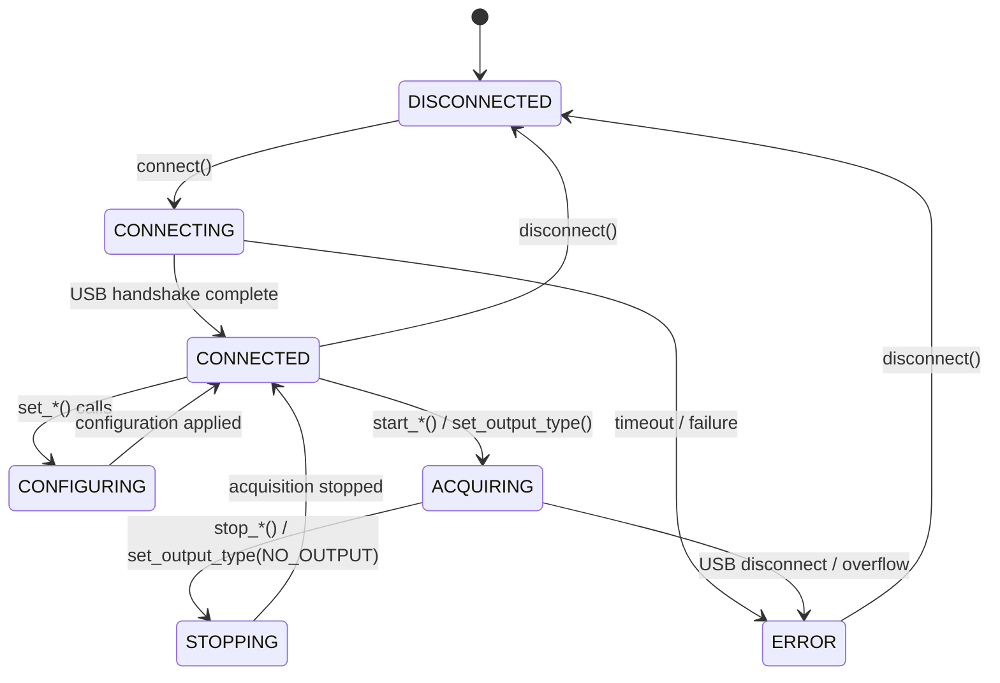
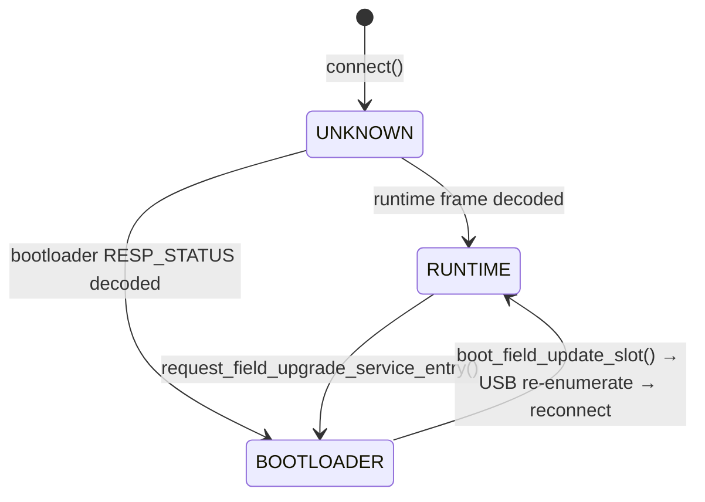

# Operating Conditions

### [USB 3.0 data connection](2_1_operating_conditions.md#usb-data-connection)

The UTT810 connects to the host PC via USB 3.0 using an FTDI FT60x SuperSpeed USB controller. The SDK communicates with the FTDI controller through the D3XX user-mode driver (`FTD3XXWU.dll`).

| Parameter | Value |
|---|---|
| USB standard | USB 3.0 (SuperSpeed, 5 Gbps signaling) |
| Controller | FTDI FT60x |
| Host driver | FTDI D3XX kernel-mode driver |
| Runtime library | `FTD3XXWU.dll` (bundled with SDK) |
| USB 2.0 fallback | Functional at reduced throughput |

The data connection carries all traffic between the host and device:
- **Host → Device:** Configuration register writes, system control commands, field update image data
- **Device → Host:** Realtime data packets (CPS, TIHI, MFCO, CORL, CORM, telemetry), raw time-tag streams, bootloader status responses

> **USB 2.0 fallback.** The UTT810 will operate on a USB 2.0 port at reduced throughput. High-bandwidth modes (`RAW_TAGS` at maximum count rates) may experience data loss or overflow when connected via USB 2.0. For production use, connect to a dedicated USB 3.0 port.

> **Cable and hub requirements.** Use a direct USB 3.0 cable connection between the device and the host PC. Avoid USB hubs unless they are USB 3.0-compliant and externally powered. The FTDI controller requires stable 5V USB bus power.

### [Device discovery and enumeration](2_1_operating_conditions.md#device-discovery-and-enumeration)

Before connecting to a UTT810, the host must discover available FTDI devices. Discovery scans the USB bus through the D3XX driver and returns a list of `nexatom_tt_info_t` device descriptors.

#### C API

```c
nexatom_tt_info_t devices[8];
size_t count = 0;

nexatom_error_code_t rc = nexatom_tt_discover_devices(devices, 8, &count);
if (rc == NEXATOM_SUCCESS && count > 0) {
    printf("Found %zu device(s)\n", count);
    printf("  Serial: %s\n", devices[0].serial_number);
    printf("  Device: %s\n", devices[0].device_name);
}
```

#### Python

```python
lib = NexatomLibrary(home=".")
devices = lib.discover_devices(max_devices=8)

for d in devices:
    print(f"Serial: {d.serial_number}")
    print(f"Device: {d.device_name}")
```

#### Device info struct (`nexatom_tt_info_t`)

Each discovered device is described by a `nexatom_tt_info_t` struct containing six null-terminated string fields, each up to 256 characters (`NEXATOM_MAX_STRING_LENGTH`):

| Field | Description | Example |
|---|---|---|
| `serial_number` | Unique device serial number | `NTT-00000001` |
| `firmware_version` | Active firmware version string | `1.0.0` |
| `hardware_version` | Hardware revision | `1.0` |
| `device_name` | Device model name | `UTT810` |
| `connection_type` | Transport type | `FTDI` |
| `connection_id` | FTDI device path / USB location | (system-dependent) |

#### Multi-device operation

When multiple UTT810 devices are connected, `discover_devices()` returns all of them. Select a specific device by matching `serial_number` or `connection_id`. The `max_devices` parameter controls the maximum number of results returned (default: 8, defined by `NEXATOM_MAX_DEVICES_DEFAULT`).

```python
devices = lib.discover_devices(max_devices=8)
target = [d for d in devices if d.serial_number == b"NTT-00000001"]
```

#### Identity-based reconnection

After firmware boot, the device resets and re-enumerates on USB. The SDK's `open_runtime_device()` context manager tracks device identity (`connection_id` and `serial_number`) across the boot cycle to reconnect to the correct device:

1. Record `connection_id` and `serial_number` before boot
2. After USB re-enumeration, call `discover_devices()`
3. Match by `connection_id` first, then `serial_number`
4. If neither matches and only one device is present, use it as fallback

### [Connection management and state machine](2_1_operating_conditions.md#connection-management-and-state-machine)

After discovery, the host creates a device handle, connects, and manages the device through a well-defined state machine.

#### Handle lifecycle

```c
/* Create handle from discovered device info */
nexatom_tt_handle device;
nexatom_tt_create(&devices[0], &device);

/* Connect with timeout */
nexatom_tt_connect(device, 5000);  /* 5 s timeout */

/* ... use device ... */

/* Disconnect and destroy */
nexatom_tt_disconnect(device);
nexatom_tt_destroy(device);        /* void return, always succeeds */
```

#### Device state machine (`nexatom_tt_state_t`)



| Value | Constant | Description |
|---|---|---|
| 0 | `NEXATOM_STATE_DISCONNECTED` | No USB connection. Initial state and state after `disconnect()`. |
| 1 | `NEXATOM_STATE_CONNECTING` | USB handshake in progress. Entered when `connect()` is called. |
| 2 | `NEXATOM_STATE_CONNECTED` | Connected and idle. Configuration and callback registration are allowed. |
| 3 | `NEXATOM_STATE_CONFIGURING` | Applying configuration to hardware registers. Transient state. |
| 4 | `NEXATOM_STATE_ACQUIRING` | Data acquisition active. Realtime callbacks or raw tag streaming in progress. |
| 5 | `NEXATOM_STATE_STOPPING` | Stopping acquisition. Transient state while flushing buffers. |
| 6 | `NEXATOM_STATE_ERROR` | Unrecoverable error (USB disconnect during acquisition, overflow). Call `disconnect()` to return to `DISCONNECTED`. |

Query the current state:

```python
state = device.state()  # Returns int matching nexatom_tt_state_t
```

```c
nexatom_tt_state_t state;
nexatom_tt_get_state(device, &state);
```

#### Connection status callback

The connection status callback provides asynchronous notification of USB connection changes and FPGA readiness:

```c
typedef void (*nexatom_connection_status_callback)(
    int connected,   /* 1 = connected, 0 = disconnected */
    int ready,       /* 1 = FPGA has emitted data, 0 = not yet */
    void* user_data
);
```

Register the callback before calling `connect()` to receive the initial connection event:

```python
device.set_connection_status_callback(
    lambda connected, ready: print(f"connected={connected} ready={ready}")
)
device.connect(timeout_ms=5000)
```

The `ready` flag transitions from `0` to `1` when the FPGA emits data for the first time after connection. It does not indicate the protocol mode — use `hardware_protocol_mode()` for that.

#### Device capabilities

After connecting, query the device's hardware capabilities:

```c
nexatom_tt_capabilities_t caps;
nexatom_tt_get_capabilities(device, &caps);
```

| Field | Type | UTT810 value | Description |
|---|---|---|---|
| `num_channels` | `uint8` | 8 | Number of input channels |
| `max_count_rate` | `uint32` | Hz | Maximum aggregate count rate |
| `time_resolution_ps` | `uint32` | ps | Timestamp resolution |
| `max_threshold_mv` | `uint16` | mV | Maximum input threshold |
| `max_histogram_bins` | `uint32` | 1024 | Maximum TIHI bins (array size) |
| `supports_calibration` | `bool` | — | Calibration support flag |
| `supports_file_saving` | `bool` | — | File saving support flag |
| `supports_external_clock` | `bool` | — | External clock input support flag |
| `supports_gating` | `bool` | — | Hardware gating support flag |

#### Python context manager

The `NexatomDevice` class supports the context manager protocol. On exit, the context manager calls `destroy()`, which internally calls `disconnect()` (if connected), clears callbacks, and releases the native handle:

```python
with lib.create_device(devices[0]) as device:
    device.connect(timeout_ms=5000)
    # ... use device ...
# disconnect + destroy called automatically, even on exception
```

The `destroy()` method is idempotent — calling it on an already-destroyed handle is a no-op.

### [Hardware protocol modes](2_1_operating_conditions.md#hardware-protocol-modes)

After USB connection, the native library determines the device's operating mode by inspecting frames on the USB transport. This mode determines which API functions are available.

#### Protocol mode enum (`nexatom_hardware_protocol_mode_t`)

| Value | Constant | Description |
|---|---|---|
| 0 | `NEXATOM_HARDWARE_PROTOCOL_MODE_UNKNOWN` | Connected, but no protocol frame decoded yet. Detection in progress. |
| 1 | `NEXATOM_HARDWARE_PROTOCOL_MODE_RUNTIME` | Runtime firmware is active. Data acquisition, callbacks, and all measurement functions are available. |
| 2 | `NEXATOM_HARDWARE_PROTOCOL_MODE_BOOTLOADER` | Bootloader is active. Only field-update operations (slot management, firmware loading) are available. Data acquisition is not possible. |

#### Mode detection

Protocol mode is determined by **positive wire evidence** — the native library must decode at least one valid protocol frame to confirm the mode:

- **RUNTIME** — Confirmed when a valid runtime data frame (telemetry, CPS, histogram, or correlation packet) is decoded on the USB transport.
- **BOOTLOADER** — Confirmed when a valid bootloader `RESP_STATUS` frame is decoded in response to a host-driven `REQ_STATUS` probe.
- **UNKNOWN** — The initial state after `connect()`. The native library performs a bounded detection sequence: passive inspection of early bytes, an optional runtime telemetry probe, and an optional `REQ_STATUS` bootloader query. If neither protocol is confirmed, the mode remains `UNKNOWN`.

> **Important.** `UNKNOWN` is a **detection state**, not a stable operating mode. Do not treat `UNKNOWN` as runtime. Poll `hardware_protocol_mode()` until a definitive mode is returned, or use the `open_runtime_device()` context manager which handles this automatically.

```python
mode = device.hardware_protocol_mode()
# Returns 0 (UNKNOWN), 1 (RUNTIME), or 2 (BOOTLOADER)
```

```c
nexatom_hardware_protocol_mode_t mode;
nexatom_tt_get_hardware_protocol_mode(device, &mode);
```

#### Mode transitions



| Transition | Trigger | Notes |
|---|---|---|
| `UNKNOWN` → `RUNTIME` | Native decodes a runtime protocol frame | Automatic during the detection window after `connect()` |
| `UNKNOWN` → `BOOTLOADER` | Native decodes a bootloader `RESP_STATUS` | Automatic during the detection window after `connect()` |
| `RUNTIME` → `BOOTLOADER` | `request_field_upgrade_service_entry()` | Stops runtime traffic, sends `FALLBACK_BOOT_CONTROL`, waits for bootloader mode |
| `BOOTLOADER` → `RUNTIME` | `boot_field_update_slot(slot)` | Device resets, re-enumerates on USB; host must reconnect and verify |

Once `BOOTLOADER` mode is confirmed, stale runtime evidence does not downgrade the decision. The mode remains `BOOTLOADER` until the device is disconnected or a slot is booted and the host reconnects.

#### Waiting for a known mode

When the mode is `UNKNOWN` after `connect()`, poll until a definitive mode is observed:

```python
from nexatomtt import (
    NEXATOM_HARDWARE_PROTOCOL_MODE_UNKNOWN,
    NEXATOM_HARDWARE_PROTOCOL_MODE_RUNTIME,
    NEXATOM_HARDWARE_PROTOCOL_MODE_BOOTLOADER,
)
import time

deadline = time.monotonic() + 20.0  # 20 s timeout
while time.monotonic() < deadline:
    mode = device.hardware_protocol_mode()
    if mode != NEXATOM_HARDWARE_PROTOCOL_MODE_UNKNOWN:
        break
    time.sleep(0.25)

if mode == NEXATOM_HARDWARE_PROTOCOL_MODE_RUNTIME:
    # Proceed with data acquisition
    pass
elif mode == NEXATOM_HARDWARE_PROTOCOL_MODE_BOOTLOADER:
    # Boot a firmware slot or perform field update
    pass
else:
    raise RuntimeError("Protocol mode detection timed out")
```

The `open_runtime_device()` context manager encapsulates this pattern and handles the full boot-if-needed sequence automatically (see §1.2.1).
