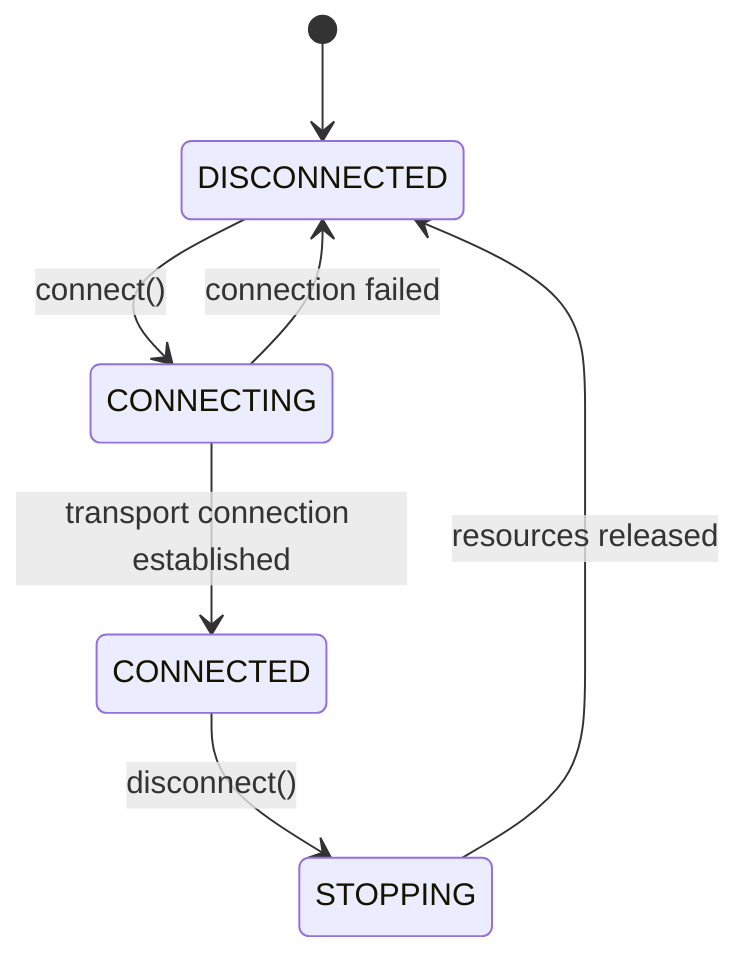
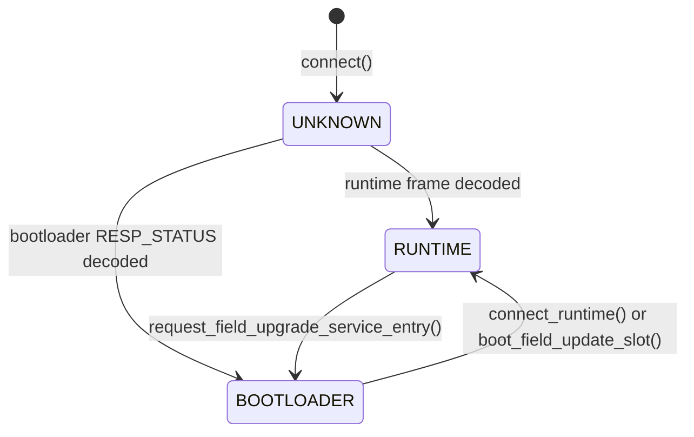

# Operating Conditions

### USB 3.0 data connection

The UTT810 connects to the host via USB 3.0 using an FTDI FT60x SuperSpeed USB controller. The SDK communicates through FTDI D3XX: `FTD3XXWU.dll` on Windows and `libftd3xx.so` on Linux. Use the matching platform SDK and the installation steps in [Installation](../01_getting_started/1_1_installation.md).

| Parameter | Value |
|---|---|
| USB standard | USB 3.0 (SuperSpeed, 5 Gbps signaling) |
| Controller | FTDI FT60x |
| Windows host driver | FTDI D3XX device driver |
| Runtime library | Windows: `FTD3XXWU.dll`; Linux: `libftd3xx.so` (bundled in the matching SDK) |
| Recommended connection | Direct USB 3.0 port and SuperSpeed cable |

The data connection carries all traffic between the host and device:
- **Host → Device:** Configuration register writes, system control commands, field update image data
- **Device → Host:** Realtime data packets (CPS, TIHI, MFCO, CORL, CORM, telemetry), raw time-tag streams, bootloader status responses

> **Throughput.** The USB signaling rate is not the sustained time-tag or file-writing rate. A connection negotiated below SuperSpeed provides less bandwidth; it is not a substitute for checking a capture at the intended count rate. For high-bandwidth `RAW_TAGS` use, connect to a dedicated USB 3.0 port.

> **Cable and hub requirements.** Prefer a direct USB 3.0 cable connection between the device and host. A hub adds another shared bandwidth and power dependency. Follow the supplied instrument's power and connector specifications; the SDK's threshold settings do not specify electrical input ratings or how the instrument is powered.

### Device discovery and enumeration

Before connecting to a UTT810, discover available FTDI devices. Discovery scans the USB bus through D3XX and returns `nexatom_tt_info_t` transport descriptors. Discovery never opens, resets or reads a board, so it is safe to call while boards are in use: it lists every attached board, including one that this or another process has open. Enumeration identifies a USB attachment; it does not itself prove runtime readiness or populate a complete hardware capability profile.

#### C API

```c
nexatom_tt_info_t devices[8];
size_t count = 0;

nexatom_error_code_t rc = nexatom_tt_discover_devices(devices, 8, &count);
if (rc == NEXATOM_SUCCESS && count > 0) {
    printf("Found %zu device(s)\n", count);
    printf("  Port:   %s\n", devices[0].connection_id);   /* the board's identity */
    printf("  Device: %s\n", devices[0].device_name);
    printf("  FT601 serial (information only): %s\n", devices[0].serial_number);
}
```

#### Python

```python
from nexatomtt import NexatomLibrary

lib = NexatomLibrary(home=".")  # The extracted SDK root
devices = lib.discover_devices(max_devices=8)

def text(field: bytes) -> str:  # ctypes returns the C strings as bytes
    return field.decode("utf-8", errors="replace")

for d in devices:
    print(f"Port:   {text(d.connection_id)}")   # the board's identity
    print(f"Device: {text(d.device_name)}")
    print(f"FT601 serial (information only): {text(d.serial_number)}")
```

#### Device info struct (`nexatom_tt_info_t`)

Each discovered device is described by a `nexatom_tt_info_t` struct containing six null-terminated string fields, each with a 256-byte capacity including the terminator (`NEXATOM_MAX_STRING_LENGTH`):

| Field | Description | Example |
|---|---|---|
| `serial_number` | FT601 USB serial, for service information only. Several boards can carry the same factory serial, so it never selects or verifies a board | `000000000001` |
| `firmware_version` | Descriptor's firmware text; use the connected profile for decoded runtime identity | (may be unavailable at enumeration) |
| `hardware_version` | Descriptor's hardware text | (may be unavailable at enumeration) |
| `device_name` | Transport/device description; do not select a protocol from this text | (device-specific) |
| `connection_type` | Transport type | `FTDI` |
| `connection_id` | `usb:` followed by the USB port path. This is the board's identity: it selects the board at connect | `usb:PCIROOT(0)#PCI(0801)#PCI(0004)#USBROOT(0)#USB(4)` (Windows), `usb:2-1.3` (Linux) |

#### Board identity: `connection_id`

A board is identified by the USB port it is plugged into, never by its FT601 serial.

- `connection_id` is `usb:` followed by the port path. On Windows the path is the PnP location path of the FT601's USB device node, for example `usb:PCIROOT(0)#PCI(0801)#PCI(0004)#USBROOT(0)#USB(4)`. On Linux it is the sysfs USB device name, for example `usb:2-1.3`. Treat the text as opaque: compare it exactly and pass the discovered record back to `create`.
- The id stays the same while the board stays in that port, across replugging and reboots. **Moving a board to another USB port changes its `connection_id`.**
- `serial_number` is the FT601 USB serial and is information only. Boards can share the factory serial, so the SDK never selects, gates or verifies a board by it.
- Connect opens exactly the board at the handle's `connection_id`, or fails. It never falls back to another board. The error text names the cause:
  - `Device not found: no FT601 at USB port …` when no board is in that port;
  - `… already open …` when the board is in use by this or another process. The discovery record has no busy flag; this error is how you find out.
- A handle created with an empty `connection_id` connects to the first free board and is bound to that board's port from then on.
- Several boards can be open at the same time, one handle each, even when they share an FT601 serial.

#### Selecting an attached instrument

Discovery may list several attached boards. `max_devices` limits enumeration results (default: 8, defined by `NEXATOM_MAX_DEVICES_DEFAULT`). The examples accept a `connection_id`; without one they proceed only when exactly one board is present, and otherwise list the ids and stop rather than guess:

```python
wanted = ""  # for example "usb:2-1.3"; empty = the only attached board
devices = lib.discover_devices(max_devices=8)
if wanted:
    matches = [d for d in devices if text(d.connection_id) == wanted]
    if not matches:
        raise RuntimeError(f"No board at {wanted}")
    device_info = matches[0]
elif len(devices) == 1:
    device_info = devices[0]
else:
    ids = ", ".join(text(d.connection_id) for d in devices)
    raise RuntimeError(f"Found {len(devices)} boards; choose one by connection_id: {ids}")
```

To run two boards together, create one handle per discovered record and connect each. Each handle has its own callbacks, savers and settings.

#### Identity-based reconnection

Runtime startup may involve a firmware transition while the FTDI bridge remains enumerated. A USB disconnect/re-enumeration is not a required success condition. `connect_runtime()` and the `open_runtime_device()` convenience context delegate discovery, boot and readiness to the native library on the selected handle.

Keep four kinds of identity separate:

1. `connection_id` identifies the board by its USB port and selects it.
2. `product_model_id` identifies the model and its supported API contract.
3. `application_image_id` identifies the running image; it is not a per-board serial stamp.
4. The instrument serial in telemetry (`device_serial`) is the runtime's own serial. Auto-reconnect compares it; it is unrelated to the FT601 USB serial.

The native API resolves these internally. An application does not need a model selector, telemetry-version setting, bootloader-presence switch or replacement handle after a successful native boot.

**Automatic reconnection** is off by default. `set_auto_reconnect(True)` makes the library retry in the background after a working link drops (a cable pull). It never opens the first connection, and an explicit `disconnect()` turns it off until the next successful connect. A reconnect goes only to the same `connection_id`. When the board there reports its identity, the SDK compares product model, hardware revision and instrument serial with the instrument that the explicit connect saw. If a different instrument now sits in that port, the SDK refuses it with an error beginning `Auto-reconnect refused:` that names both instruments, disconnects the handle and stops retrying. Readiness after a reconnect is reported through the connection status callback.

### Connection management and state machine

After discovery, the host creates a device handle, connects, and manages the device through a well-defined state machine.

#### Handle lifecycle

```c
/* Assumes successful discovery and count == 1. */
nexatom_tt_handle device = NULL;
nexatom_error_code_t rc = nexatom_tt_create(&devices[0], &device);
if (rc == NEXATOM_SUCCESS) {
    /* One budget covers automatic discovery, boot if needed, and readiness. */
    rc = nexatom_tt_connect_runtime(device, 20000);
    if (rc == NEXATOM_SUCCESS) {
        /* Configure channels, then start the chosen measurement here. */
    }
    /* Stop measurement/output and close active savers before this point. */
    nexatom_error_code_t close_rc = nexatom_tt_disconnect(device);
    if (close_rc != NEXATOM_SUCCESS) {
        fprintf(stderr, "Disconnect failed: %d\n", (int)close_rc);
    }
    nexatom_tt_destroy(device);  /* Releases the handle; returns void. */
}
```

#### Device state machine (`nexatom_tt_state_t`)



| Value | Constant | Description |
|---|---|---|
| 0 | `NEXATOM_STATE_DISCONNECTED` | No USB connection. Initial state and state after `disconnect()`. |
| 1 | `NEXATOM_STATE_CONNECTING` | USB handshake in progress. Entered when `connect()` is called. |
| 2 | `NEXATOM_STATE_CONNECTED` | Transport connected; runtime authority is a separate condition. |
| 3 | `NEXATOM_STATE_CONFIGURING` | Public state vocabulary for configuration activity. |
| 4 | `NEXATOM_STATE_ACQUIRING` | Public state vocabulary for acquisition activity. |
| 5 | `NEXATOM_STATE_STOPPING` | A stop/cleanup transition is underway. |
| 6 | `NEXATOM_STATE_ERROR` | Error state; inspect the returned error/log and perform cleanup. |

This enum is a coarse connection/lifecycle view. Do not assume every setter traverses `CONFIGURING`, every enabled FPGA engine changes it to `ACQUIRING`, or an overflow always produces `ERROR`. Use the operation's result, packet status/quality fields and the native profile for the condition you actually need to establish. In particular, `CONNECTED` is not equivalent to usable runtime.

Query the current state:

```python
state = device.state()  # Returns int matching nexatom_tt_state_t
```

```c
nexatom_tt_state_t state;
nexatom_tt_get_state(device, &state);
```

#### Connection status callback

The connection status callback provides asynchronous notification of USB connection changes and FPGA readiness:

```c
typedef void (*nexatom_connection_status_callback)(
    int connected,   /* 1 = connected, 0 = disconnected */
    int ready,       /* Native readiness notification; inspect the profile too. */
    void* user_data
);
```

Registering the callback only observes the connection; it does not open one. Register it before connecting to receive the initial connection event:

```python
device.set_connection_status_callback(
    lambda connected, ready: print(f"connected={connected} ready={ready}")
)
device.connect_runtime(timeout_ms=20000)
```

The callback separates transport connection from native readiness. A received byte, boot acknowledgement or `connected == 1` alone is not permission to configure measurement hardware. `connect()` and `connect_runtime()` return success only when the device can be controlled, so the callback is not a prerequisite for the first control call (a device in bootloader mode is the exception: `connect()` returns once the transport is open). The callback is where readiness is reported after an automatic reconnect. Keep this callback short and avoid making blocking device calls from it.

#### Device capabilities

After connecting, query the device's hardware capabilities:

```c
nexatom_tt_capabilities_t caps;
nexatom_tt_get_capabilities(device, &caps);
```

| Field | Type | UTT810 value | Description |
|---|---|---|---|
| `num_channels` | `uint8` | 8 | Number of input channels |
| `max_count_rate` | `uint32` | Hz | Maximum aggregate count rate |
| `time_resolution_ps` | `uint32` | ps | Timestamp resolution |
| `max_threshold_mv` | `uint16` | mV | Maximum input threshold |
| `max_histogram_bins` | `uint32` | Query it | Maximum configurable TIHI bin count; distinct from the fixed callback array capacity |
| `supports_calibration` | `bool` | — | Calibration support flag |
| `supports_file_saving` | `bool` | — | File saving support flag |
| `supports_external_clock` | `bool` | — | External clock input support flag |
| `supports_gating` | `bool` | — | Hardware gating support flag |

These fields describe the SDK capability interface. A `time_resolution_ps` value specifies the timestamp representation; it is not an independently measured timing precision, and `max_threshold_mv` is an accepted configuration limit, not a connector damage limit.

The versioned profile provides the model-aware details needed by a measurement application:

```python
profile = device.get_device_profile()
caps = device.get_capabilities()
channels = [ch for ch in range(8)
            if int(profile.effective_public_tdc_mask) & (1 << ch)]
print("Available inputs:", channels)
print("Maximum input delay (ps):", profile.max_channel_input_delay_ps)
print("Maximum configurable TIHI bins:", caps.max_histogram_bins)
```

| Profile field | Meaning for the application |
|---|---|
| `effective_public_tdc_mask` | Inputs authorized for public controls; use the bits, not an assumed contiguous count |
| `physical_tdc_count`, `physical_tdc_mask` | Physical layout information, which does not grant access to extra inputs |
| `dtc_output_count` | Reported digital timing output count; separate from input channels |
| `feature_flags` (Python) | Combined feature bits; gate optional measurement modes with these |
| `supported_output_mode_mask` | Permitted output modes, indexed by output-mode enum value |
| `max_channel_input_delay_ps` | Resolved maximum delay accepted for this model/image |
| `test_pulse_clock_hz`, `test_pulse_min_period_cycles`, `test_pulse_max_period_cycles` | Timing and bounds for the internal test source |

In C, initialize `nexatom_tt_device_profile_v1_t.struct_size` and `struct_version` before calling `nexatom_tt_get_device_profile_v1()`. See [Device Connection](../07_c_api/7_4_device_connection.md) for the full record contract.

#### Python context manager

The `NexatomDevice` class supports the context manager protocol. On exit, the context manager calls `destroy()`, which internally calls `disconnect()` (if connected), clears callbacks, and releases the native handle:

```python
with lib.create_device(devices[0]) as device:
    device.connect_runtime(timeout_ms=20000)
    # ... use device ...
# disconnect + destroy called automatically, even on exception
```

The `destroy()` method is idempotent — calling it on an already-destroyed handle is a no-op.

### Hardware protocol modes

After USB connection, the native library determines the device's operating mode by inspecting frames on the USB transport. This mode determines which API functions are available.

#### Protocol mode enum (`nexatom_hardware_protocol_mode_t`)

| Value | Constant | Description |
|---|---|---|
| 0 | `NEXATOM_HARDWARE_PROTOCOL_MODE_UNKNOWN` | Connected, but no protocol frame decoded yet. Detection in progress. |
| 1 | `NEXATOM_HARDWARE_PROTOCOL_MODE_RUNTIME` | Runtime traffic is recognized. The resolved profile determines which acquisition functions and controls are available. |
| 2 | `NEXATOM_HARDWARE_PROTOCOL_MODE_BOOTLOADER` | Bootloader is active. Only field-update operations (slot management, firmware loading) are available. Data acquisition is not possible. |

#### Mode detection

Protocol mode is determined by **positive wire evidence** — the native library must decode at least one valid protocol frame to confirm the mode:

- **RUNTIME** — Confirmed from recognized runtime traffic. Runtime detection and authorization of a particular model/image are separate steps; raw traffic is not a bootloader response.
- **BOOTLOADER** — Confirmed when a valid bootloader `RESP_STATUS` frame is decoded in response to a host-driven `REQ_STATUS` probe.
- **UNKNOWN** — The initial state after `connect()`. The native library performs a bounded detection sequence: passive inspection of early bytes, an optional runtime telemetry probe, and an optional `REQ_STATUS` bootloader query. If neither protocol is confirmed, the mode remains `UNKNOWN`.

> **Important.** `UNKNOWN` is a **detection state**, not permission to use runtime controls. Normal measurement clients call `connect_runtime()` or `open_runtime_device()`; they do not need to implement protocol polling themselves.

```python
mode = device.hardware_protocol_mode()
# Returns 0 (UNKNOWN), 1 (RUNTIME), or 2 (BOOTLOADER)
```

```c
nexatom_hardware_protocol_mode_t mode;
nexatom_tt_get_hardware_protocol_mode(device, &mode);
```

#### Mode transitions



| Transition | Trigger | Notes |
|---|---|---|
| `UNKNOWN` → `RUNTIME` | Native decodes a runtime protocol frame | Automatic during the detection window after `connect()` |
| `UNKNOWN` → `BOOTLOADER` | Native decodes a bootloader `RESP_STATUS` | Automatic during the detection window after `connect()` |
| `RUNTIME` → `BOOTLOADER` | `request_field_upgrade_service_entry()` followed by status confirmation | A request alone is not proof of service; confirm an actual bootloader response |
| `BOOTLOADER` → `RUNTIME` | `connect_runtime()` or explicit `boot_field_update_slot(slot)` | Native boot/readiness handling retains the selected handle; a USB re-enumeration is not required |

Once service mode is confirmed, stale runtime packets must not be treated as a new runtime session. Native lifecycle handling clears/replaces the relevant session evidence as it performs a boot transition.

#### Waiting for a known mode

An inspection or field-update client can use low-level `connect()` and query protocol mode without automatically booting. The following bounded loop illustrates mode inspection only; normal acquisition uses `connect_runtime()` instead:

```python
from nexatomtt import (
    NEXATOM_HARDWARE_PROTOCOL_MODE_UNKNOWN,
    NEXATOM_HARDWARE_PROTOCOL_MODE_RUNTIME,
    NEXATOM_HARDWARE_PROTOCOL_MODE_BOOTLOADER,
)
import time

deadline = time.monotonic() + 20.0  # 20 s timeout
while time.monotonic() < deadline:
    mode = device.hardware_protocol_mode()
    if mode != NEXATOM_HARDWARE_PROTOCOL_MODE_UNKNOWN:
        break
    time.sleep(0.25)

if mode == NEXATOM_HARDWARE_PROTOCOL_MODE_RUNTIME:
    # Finish native profile/readiness checks before configuring acquisition.
    device.connect_runtime(timeout_ms=20000)
    pass
elif mode == NEXATOM_HARDWARE_PROTOCOL_MODE_BOOTLOADER:
    # Boot a firmware slot or perform field update
    pass
else:
    raise RuntimeError("Protocol mode detection timed out")
```

The `open_runtime_device()` context manager delegates the normal boot-if-needed sequence to native `connect_runtime()`. It does not flash an image or change the persistent default slot. See [Runtime / Bootloader Handoff](2_12_runtime_handoff.md).
