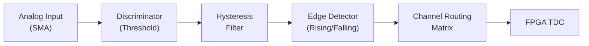

# Input Channels

The UTT810 features 8 independent input channels with configurable discriminator logic. All input channel configurations are applied directly to the FPGA hardware registers.



> **Python Wrapper Support.** Advanced input configurations (edge type, hysteresis, and routing) are currently only exposed in the native C API. They are not yet wrapped in the `NexatomDevice` Python class.

### [Channel count and indexing](2_2_input_channels.md#channel-count-and-indexing)

The UTT810 hardware provides 8 physical input channels. Throughout both the native C API and the Python wrapper, channels are strictly zero-indexed.

| Parameter | Range |
|---|---|
| Channel index | `0` through `7` |
| Count (`NEXATOM_MAX_CHANNELS`) | `8` |

Passing a channel index outside the `0–7` range will result in a `NEXATOM_ERROR_INVALID_PARAMETER` return code or a `NexatomError` exception.

### [Threshold configuration](2_2_input_channels.md#threshold-configuration)

The discriminator voltage threshold can be configured independently for each channel. The threshold is specified in millivolts (mV). The maximum valid threshold is hardware-dependent and can be queried via the `max_threshold_mv` field in `nexatom_tt_capabilities_t`.

#### C API

```c
nexatom_tt_set_channel_threshold(
    nexatom_tt_handle device,
    uint8_t channel,
    uint16_t threshold_mv
);
```

#### Python

```python
device.set_channel_threshold(channel=0, threshold_mv=1000)
```

### [Edge type selection](2_2_input_channels.md#edge-type-selection)

Input channels can be configured to generate a time tag on either the rising or falling edge of the incoming pulse.

| `edge_type` value | Trigger edge |
|---|---|
| `0` | Rising edge |
| `1` | Falling edge |

#### C API

```c
nexatom_tt_set_channel_edge_type(
    nexatom_tt_handle device,
    uint8_t channel,
    uint8_t edge_type
);
```

*(This function is not currently exposed in the Python wrapper.)*

### [Input hysteresis](2_2_input_channels.md#input-hysteresis)

To prevent multi-triggering or ringing on noisy input signals, a hysteresis voltage can be applied to the discriminator comparator.

The maximum permitted hysteresis is 175 mV, which corresponds to 50% of the typical 350 mV LVDS differential voltage swing.

#### C API

```c
nexatom_tt_set_channel_hysteresis(
    nexatom_tt_handle device,
    uint8_t channel,
    uint16_t hysteresis_mv
);
```

*(This function is not currently exposed in the Python wrapper.)*

### [Channel routing](2_2_input_channels.md#channel-routing)

Internal FPGA logic permits routing the physical signal from one hardware input channel to another logical software channel before time-tag generation. This is useful for multi-trigger logic mapping without external cable splitters.

#### C API

```c
nexatom_tt_set_channel_routing(
    nexatom_tt_handle device,
    uint8_t source_channel,
    uint8_t target_channel
);
```

*(This function is not currently exposed in the Python wrapper.)*
