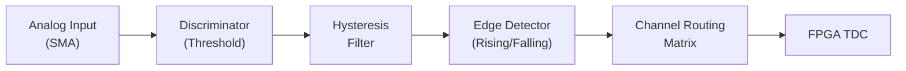

# Input Channels

The UTT810 exposes up to 8 input channels through this SDK, with configurable discriminator logic. The native API validates configuration against the connected device profile and translates accepted physical-unit settings into hardware commands.



The diagram is a functional view of the signal path, not a claim about a particular board's placement of each circuit. Threshold, edge, hysteresis, delay and routing controls are available in both the C API and `NexatomDevice` Python class.

### Channel count and indexing

Throughout both the C API and Python wrapper, public channels are zero-indexed. The public array capacity is eight; use `effective_public_tdc_mask` from `device.get_device_profile()` to determine which indices the connected model/image authorizes.

| Parameter | Range |
|---|---|
| Channel index | `0` through `7`, restricted by the effective public mask |
| Count (`NEXATOM_MAX_CHANNELS`) | `8` |

Passing an out-of-range index is rejected. An in-range index outside the effective public mask is also rejected; a physical TDC count does not grant access to additional channels. Check C return codes and handle Python exceptions before starting acquisition.

```python
profile = device.get_device_profile()
channel = 0
if not int(profile.effective_public_tdc_mask) & (1 << channel):
    raise RuntimeError(f"Input {channel} is not available on this device")
```

### Threshold configuration

The discriminator voltage threshold can be configured independently for each channel, in millivolts (mV). The SDK accepts the unipolar DAC range `0..2500 mV`; also consult `max_threshold_mv` in `nexatom_tt_capabilities_t` (`device.get_capabilities()` in Python). The native API performs the DAC conversion, so pass millivolts rather than a DAC code.

This is a configuration range, **not the maximum voltage that may safely be applied to the input connector**. Use the instrument's electrical specifications for amplitude, polarity, impedance and termination. Command acceptance also does not constitute analog readback or calibration of the discriminator voltage.

#### C API

```c
nexatom_error_code_t nexatom_tt_set_channel_threshold(
    nexatom_tt_handle device,
    uint8_t channel,
    uint16_t threshold_mv
);
```

#### Python

```python
device.set_channel_threshold(channel=0, threshold_mv=1000)
```

### Edge type selection

Input channels can be configured to generate a time tag on either the rising or falling edge of the incoming pulse.

| `edge_type` value | Trigger edge |
|---|---|
| `0` | Rising edge |
| `1` | Falling edge |

#### C API

```c
nexatom_error_code_t nexatom_tt_set_channel_edge_type(
    nexatom_tt_handle device,
    uint8_t channel,
    uint8_t edge_type
);
```

#### Python

```python
device.set_channel_edge_type(channel=0, edge_type=0)  # Rising edge
```

An actual polarity change can fence incoming events and trigger hardware recalibration before resuming prior acquisition intent. A no-op setting does not need that recalibration. Successful command admission is not proof of completed recalibration, so make the change between measurements and check the available telemetry before relying on the next timing result.

### Input hysteresis

To prevent multi-triggering or ringing on noisy input signals, a hysteresis voltage can be applied to the discriminator comparator.

The accepted hysteresis setting is `0..175 mV`. The native conversion uses a 350 mV reference model to derive a 10-bit control code; callers pass the requested millivolts. This accepted setting range is not a specification of permissible external input voltage or guaranteed analog accuracy.

#### C API

```c
nexatom_error_code_t nexatom_tt_set_channel_hysteresis(
    nexatom_tt_handle device,
    uint8_t channel,
    uint16_t hysteresis_mv
);
```

#### Python

```python
device.set_channel_hysteresis(channel=0, hysteresis_mv=10)
```

Choose enough hysteresis to suppress repeated triggering from noise around the threshold while preserving the pulses you intend to measure. Verify an external signal separately: internal test pulses exercise the digital path and cannot establish that the threshold or hysteresis is appropriate for an analog detector.

### Channel routing

The routing control changes the FPGA channel-selection mapping using `source_channel` and `target_channel`. Both use public zero-based channel indices. It can be useful when adapting a logical channel assignment without changing cables, but it is not a guarantee of arbitrary analog signal duplication or a replacement for an electrical splitter. Leave routing at the device's normal mapping unless the experiment explicitly requires a remap.

#### C API

```c
nexatom_error_code_t nexatom_tt_set_channel_routing(
    nexatom_tt_handle device,
    uint8_t source_channel,
    uint8_t target_channel
);
```

#### Python

```python
# Explicitly restore the normal channel-0-to-channel-0 mapping.
device.set_channel_routing(source_channel=0, target_channel=0)
```

### Applying a channel configuration together

Make configuration changes while acquisition and output are quiet. This example assumes `connect_runtime()` has succeeded and channel 0 is authorized:

```python
from nexatomtt import NEXATOM_OUTPUT_NO_OUTPUT

device.set_output_type(NEXATOM_OUTPUT_NO_OUTPUT)
device.enable_system(False)
device.enable_channel_test_pulse(0, False)  # Use the physical input.
device.set_channel_threshold(0, 500)       # mV; choose for your detector.
device.set_channel_edge_type(0, 0)         # Rising edge.
device.set_channel_hysteresis(0, 10)       # mV.
device.set_channel_input_delay(0, 0)       # ps; no added delay.
# Register callbacks/open savers and configure the measurement before enabling it.
```

For different settings on each input, adapt the commented `ChannelSettings` entries in the SDK's `python/examples/channel_setup.py`. Keep its profile/range checks rather than hard-coding a model from a filename.
