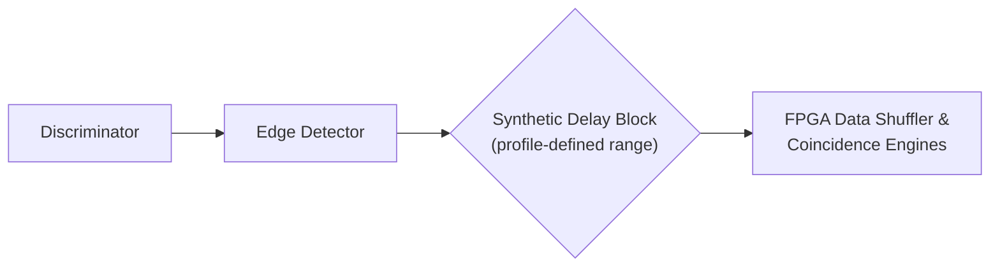

## Synthetic Input Delay

Programmable delays can be applied independently to input channels. This feature is typically used to compensate for differing external cable lengths or to align correlated signals before multi-channel coincidence processing. Current extended-delay Zynq and Kintex images can support up to 256 ns; applications must query the connected profile because a legacy image may have a smaller limit.



### Per-channel input delay configuration

The requested delay is applied in the FPGA channel timing path. The diagram shows its purpose in the acquisition chain; it does not prescribe the circuit implementation for every model.

| Parameter | Range | API unit |
|---|---|---|
| `delay_ps` | `0` to `profile.max_channel_input_delay_ps` | Integer picoseconds (ps) |
| Extended-delay profile | Up to `256000 ps` = `256 ns` | Same setter and unit |
| Legacy profile | May be limited to `4000 ps` = `4 ns` | Use the reported limit |

Providing a value above the resolved limit returns `NEXATOM_ERROR_INVALID_PARAMETER` in C or raises `NexatomError` in Python. Integer picoseconds are the interface unit, not a promise of one-picosecond physical accuracy or step size. Delay zero removes the requested added delay.

The API permits delay changes while acquisition is running, but a real change is fenced in hardware and may discard in-flight input/encoded events. Apply a delay between measurements when that intentional capture gap would otherwise matter. Writing the already-selected value is non-disruptive.

#### C API

```c
nexatom_error_code_t nexatom_tt_set_channel_input_delay(
    nexatom_tt_handle device,
    uint8_t channel,
    uint32_t delay_ps
);
```

#### Python

```python
# If channel 0 arrives 2.5 ns earlier, delay that earlier channel to align it.
profile = device.get_device_profile()
delay_ps = 2500
if delay_ps > int(profile.max_channel_input_delay_ps):
    raise ValueError("Requested compensation exceeds the device delay range")
device.set_channel_input_delay(channel=0, delay_ps=delay_ps)
```

Adding a delay to the already-late channel increases the mismatch. Adding the same delay to both channels leaves their relative timing unchanged. Measure the initial offset and apply compensation to the earlier channel; do not infer cable delay solely from length without accounting for propagation speed.

To explore the extended range, request a value such as `220000 ps` (220 ns) on one channel only after checking the profile maximum, then compare the measured timing distribution with the zero-delay baseline. Keep histogram range, bin width and coincidence window wide enough to contain the shifted events. Command acceptance verifies the allowed setting; an observed peak shift is the measurement of its effect.
