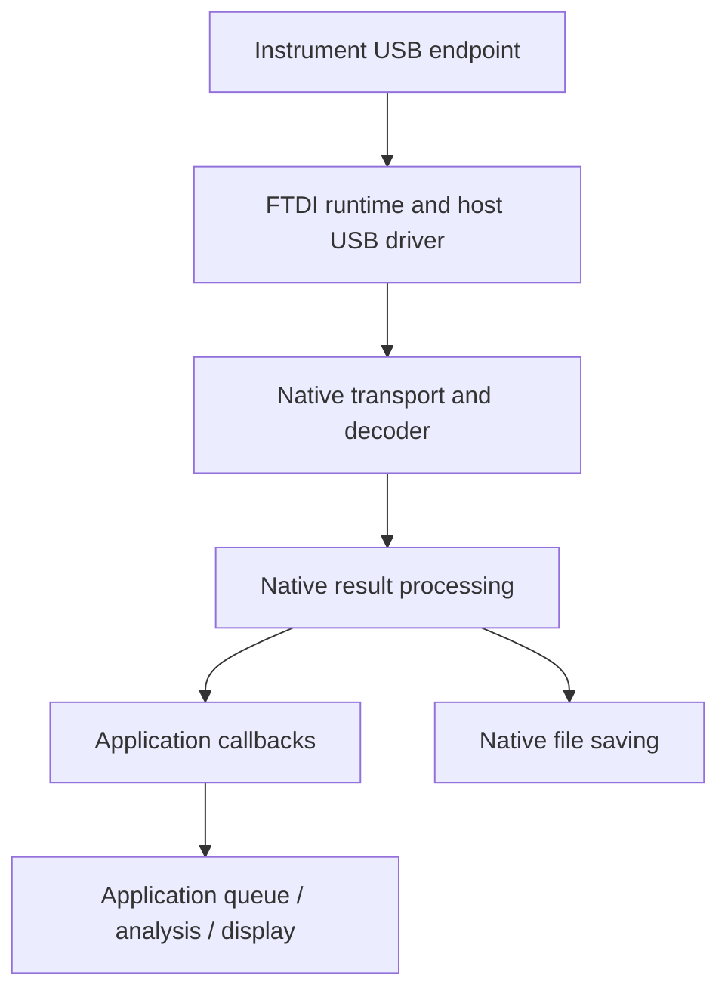

# 4. Software overview

The Windows/Linux SDK exposes a native C ABI. C++ uses the same public header; Python uses ctypes wrappers around that ABI. Applications do not need internal C++ classes or firmware packet parsing to configure supported measurements.

## Device and data ownership

Discovery returns selection records. A created device handle owns its native session until destruction. Native runtime startup resolves protocol/profile readiness; the application then chooses a measurement using the authorized channels, features and limits.

Acquisition data flows from the instrument through native transport/decoding to callbacks and native file savers. Scientific fitting is host processing. Raw NXTT and processed CSV/TAB/HDF5 are different output products; none is a blanket guarantee of lossless maximum-rate acquisition.

## Architecture and data flow

The native library separates USB reads, decoding, result processing and file delivery so an application can consume structured data. These stages buffer work, but cannot guarantee that an arbitrary input rate or host scheduling delay will never overflow a buffer.

The diagram describes ownership and data flow, not an additional client protocol. C/C++ and Python consumers share this native path.

### Memory management

Opaque handles hide native implementation details. Pair each successful `nexatom_tt_create` with `nexatom_tt_destroy`; pair each successful reader open with `nexatom_tt_close_time_tag_reader`. A disconnect retires the transport session without freeing the device handle. Caller-provided output buffers remain caller-owned.

Natural C ABI alignment remains significant even when a record contains explicit padding. Arrays and nested structures must match the shipped header exactly. Keep SDK/native identities together instead of mixing bindings from one archive with a library from another.

## Errors and completion

Check each declaration's return type: many operations return `nexatom_error_code_t`, while create/version/logging/close functions may use other types. Python converts native failures to exceptions. Keep an error's message before another operation changes diagnostic state.

A successful command can mean admission, not completion. Observe expected acquisition status, telemetry response or field-update outcome. A cached value is not necessarily hardware readback. Connection, system enable, output mode, engine start and file saving are distinct operations.

## Callbacks and concurrency

Callbacks can run on native workers or synchronously within an API call; do not assume a UI thread. C callbacks must copy data into application-owned storage before returning if later work needs it, including deep-copying records in a borrowed configuration view. Python's public wrappers copy records for Python ownership. Keep handlers short and hand expensive work to an application queue.

Thread safety does not mean every concurrent or callback-reentrant operation is allowed. Handle BUSY/timeouts and keep ordinary callback/user-data ownership until native destruction completes; clearing a registration alone does not fence an already-selected invocation. Logging has separate quiescent unregister. See [callback lifetime](../06_in_depth_guides/6_5_callback_thread_safety_and_data_lifetime.md).

## Application structure

Start from the packaged processed/raw templates. Keep one place responsible for selection, readiness, measurement start, final results, sink finalization and disconnect. Profile validation belongs before controls, while interpretation of results must retain status, availability and units.

[Manual contents](../index.md) · [Python reference](../05_api_reference/index.md) · [C API](../07_c_api/index.md)
