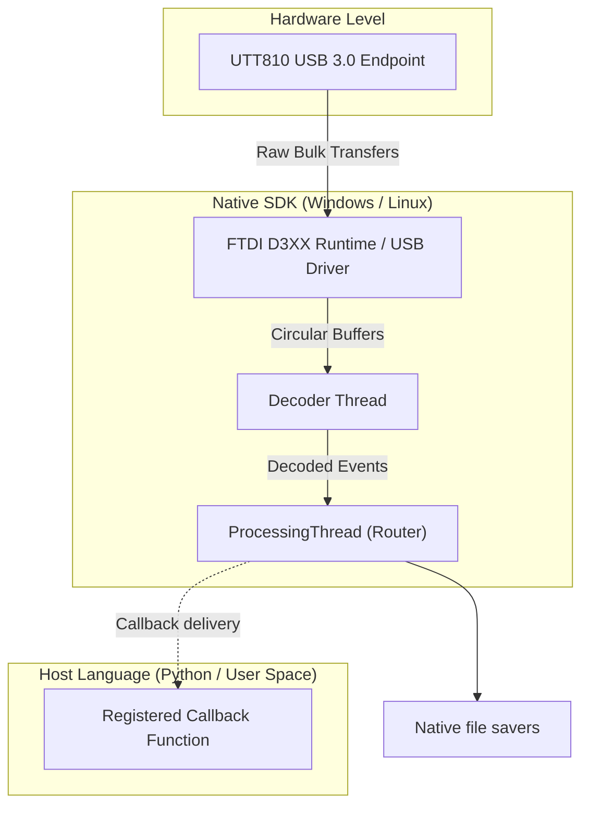

# Software Overview

## [Architecture and Data Flow](index.md#architecture-and-data-flow)

The NexatomTT SDK architecture is designed to robustly manage high-bandwidth streaming data while exposing a deterministic, state-safe control surface to the host application.

### [Native library](index.md#native-library)

The core engine is implemented in C++ and distributed as `nexatomTT.dll` on Windows and `libnexatomTT.so` on Linux. The public SDK exposes a flat `extern "C"` Application Binary Interface (ABI). C, C++ and Python applications use this same interface; Python's `ctypes` wrapper handles the native records and calls. This avoids requiring customers to depend on internal C++ classes or a particular C++ standard-library ABI. Keep the library, headers and bindings from the same SDK package together.

### [Data pipeline](index.md#data-pipeline)

Data acquisition uses a pipelined threading architecture to absorb short host scheduling delays and separate USB work from application processing. Its buffers are finite; this is not a guarantee against overflow at every input rate:

1.  **FTDI Transport:** Native transport fetches bulk transfers through the FTDI D3XX runtime and host USB stack, moving received bytes into internal buffers.
2.  **Decoder:** An intermediate processing stage parses the proprietary binary framing protocol, reconstructing hardware events, timestamps, and diagnostic telemetry.
3.  **ProcessingThread:** A routing thread aggregates the decoded data structures into their respective software modules (e.g., TIHI, MFCO, CPS).
4.  **Callbacks and saving:** Results are delivered to registered application callbacks and enabled native file savers. A file saver can write results without routing each result through Python.

### [Thread safety model](index.md#thread-safety-model)

The native SDK synchronizes its internal operations, but thread safety does not mean every overlapping operation is valid. A configuration change during acquisition or a lifecycle operation called from its own callback can be rejected. Keep one application control thread responsible for start, stop and destruction; handle BUSY and timeout results explicitly.

Conversely, host software must respect the callback dispatch model:
*   Data callbacks normally arrive on native workers. Some events, such as connection callback registration and field-update progress, can invoke the handler synchronously within the calling API operation.
*   If a host language callback (e.g., in Python) must update a GUI, modify shared state, or interact with an event loop, **the user is strictly responsible** for implementing appropriate thread-safety mechanisms (e.g., locks or thread-safe message queues) to bridge the background worker thread to the main execution thread.

### [Memory management](index.md#memory-management)

The native library completely encapsulates all internal memory allocations and hardware buffer lifecycles. Users are never required to manually allocate or free memory for device communication.

Most C data callbacks receive a fixed record by value. A C caller must copy that record into application-owned storage before returning if it is needed later. The versioned configuration-dump callback is a borrowed pointer view and requires a deep copy of its records. The public Python wrapper makes owned copies for Python handlers, including that view. See [callback lifetime](../06_in_depth_guides/6_5_callback_thread_safety_and_data_lifetime.md) for reference retention and shutdown rules.

## [Precompiled Libraries and Language Bindings](index.md#precompiled-libraries-and-language-bindings)

### [Native DLL and runtime dependencies](index.md#native-dll-and-runtime-dependencies)

The Windows x64 SDK packages the native library and the FTDI runtime together in the extracted SDK root. Keep these files together:

*   `nexatomTT.dll`: The core NexatomTT library.
*   `FTD3XXWU.dll`: The proprietary FTDI D3XX runtime driver.
*   The compiler runtime and HDF5 are linked into `nexatomTT.dll`; no separate runtime DLLs are shipped.

The Linux x64 package supplies matching shared libraries and the FTDI runtime. Keep `libnexatomTT.so`, `libnexatomTT.so.1` and `libftd3xx.so` together in the supplied layout. Follow the package's Linux setup instructions for USB permissions; an x64 package does not run on an ARM host.

### [Python package (`nexatomtt`)](index.md#python-package-nexatomtt)

The official Python wrapper provides object-oriented abstractions over the C API without introducing external dependencies. It relies purely on the Python standard library (`ctypes`).

*   `nexatomtt._native`: Raw, low-level `ctypes` bindings mappings.
*   `nexatomtt.analysis`: Helpers for Multi-Fold Coincidence (MFCO) pattern decoding.
*   `nexatomtt.runtime_boot`: A context-manager helper (`open_runtime_device()`) that delegates normal measurement startup to native `connect_runtime()` on one handle.

## [C API](index.md#c-api)

### [Header organization](index.md#header-organization)

The entire C API is defined in a single, comprehensive header file (`nexatomtt_c_api.h`). It is logically partitioned into constants, structs, callback typedefs, and functional API groups (e.g., Device Lifecycle, Hardware Config, Telemetry).

### [Error handling convention](index.md#error-handling-convention)

To ensure deterministic error checking across all languages, the SDK avoids C++ exceptions at the ABI boundary.

*   **Return Type:** Most control operations return a `nexatom_error_code_t` (`int32`). Check the declaration: constructors, string queries, logging controls and close functions can have other return types.
*   **Success:** A return value of `0` (`NEXATOM_SUCCESS`) indicates success.
*   **Failure:** A negative value indicates an error (e.g., `NEXATOM_ERROR_NOT_CONNECTED`).
*   **Error Details:** The caller can invoke `nexatom_tt_get_last_error_message()` on the calling thread to retrieve a descriptive string of the most recent failure, or use `nexatom_tt_get_error_message(code)` for a generic lookup.

### [Opaque handle pattern](index.md#opaque-handle-pattern)

Device instances are managed using opaque pointers to prevent the host application from tampering with internal state structures:
*   `nexatom_tt_handle`: Represents an active session with a physical device. Must be explicitly freed via `nexatom_tt_destroy()`.
*   `nexatom_tt_time_tag_reader_t*`: Represents an offline binary file parser. Must be closed via `nexatom_tt_close_time_tag_reader()`.

`disconnect()` closes the transport session but does not free a device handle. `close()`/native destruction releases its ownership. Ordinary applications select each instrument by its `connection_id` (one handle per board) and establish native runtime readiness before configuring it. The native profile supplies model, image, available channel masks, features and control limits; clients do not decode firmware identity packets or ask users to select a telemetry protocol.
