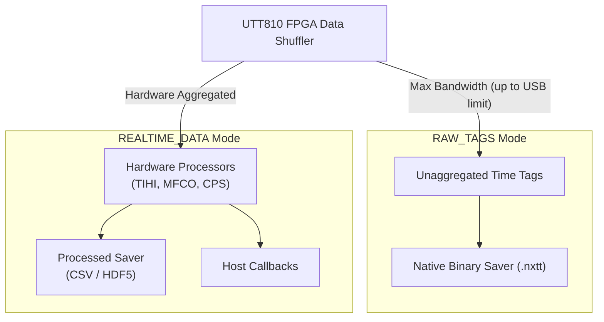
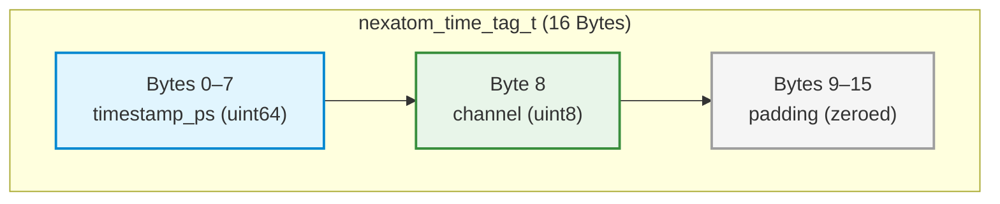

## File Saving and Data Export

The NexatomTT SDK features a high-performance native file writing engine capable of streaming data directly to disk without routing payloads through the host language's virtual machine (e.g., the Python interpreter). The export pipeline strictly bifurcates based on the hardware output mode configured on the FPGA.

### [Raw time-tag file saving (`RAW_TAGS` mode)](6_1_file_saving_and_data_export.md#raw-time-tag-file-saving)

When the device output type is set to `NEXATOM_OUTPUT_RAW_TAGS`, all on-board aggregation engines (TIHI, MFCO) are suspended. The SDK dedicates maximum USB bandwidth to streaming raw, individual photon events to disk.

The native file saver is configured via the `nexatom_time_tag_file_config_t` struct and enabled via `nexatom_tt_enable_time_tag_file_saving()`.

**File Rotation:**
To prevent single-file filesystem limits on long acquisitions, the native saver automatically rotates output files based on configured thresholds:
*   `max_file_size_mb`: Triggers rotation when the file exceeds this byte limit.
*   `max_duration_minutes`: Triggers rotation based on elapsed wall-clock time.
*   `max_event_count`: Triggers rotation after a specific number of time tags.
*   `rotate_on_acquisition_boundary`: Forces a new file when a `start/stop` condition is triggered.

**Naming Convention:**
The SDK automatically generates sequentially numbered files using the following pattern:
`<base_prefix>_<timestamp>_TAGS_<sequence>_<suffix>.<ext>`

### [Processed data file saving (`REALTIME_DATA` mode)](6_1_file_saving_and_data_export.md#processed-data-file-saving)

When the device output type is set to `NEXATOM_OUTPUT_REALTIME_DATA`, the native saver can persist the aggregated payload packets (CPS, TIHI, MFCO, CORM, CORL, TELM) to disk concurrently with callback dispatch.

This is enabled via `nexatom_tt_enable_processed_file_saving()` using `nexatom_processed_file_config_t`. Supported export formats include:
*   **HDF5:** The recommended binary format for complex hierarchical structures (like Multi-Tau correlation matrices and TIHI fit results).
*   **CSV / Tab-Separated:** Best for simple visual inspection of CPS and telemetry data.

### [NXTT binary file format](6_1_file_saving_and_data_export.md#nxtt-binary-file-format)

The `.nxtt` file format is a proprietary, zero-overhead binary container designed exclusively for raw time tags. It is uncompressed to ensure that write speeds never bottleneck the USB 3.0 stream.

**1. File Header**
Every `.nxtt` file begins with a standardized metadata header:
*   `Magic bytes`: The ASCII string `"NXTT"` (4 bytes).
*   `Creation timestamp`: A 64-bit unsigned integer representing microseconds since the UNIX epoch.
*   `Output data type`: A 32-bit integer verifying the payload origin.

**2. Data Payload (Record Layout)**
Immediately following the header, the file contains a packed array of `nexatom_time_tag_t` structs. Each record is exactly **16 bytes** long to guarantee optimal 64-bit CPU cache alignment.

*   **`timestamp_ps`**: The absolute hardware timestamp in picoseconds since the acquisition started.
*   **`channel`**: The zero-indexed physical channel that detected the edge.
*   **`padding`**: Reserved space. These 7 bytes are explicitly zeroed by the SDK to prevent uninitialized memory leakage and to ensure the struct aligns perfectly on 16-byte boundaries.
