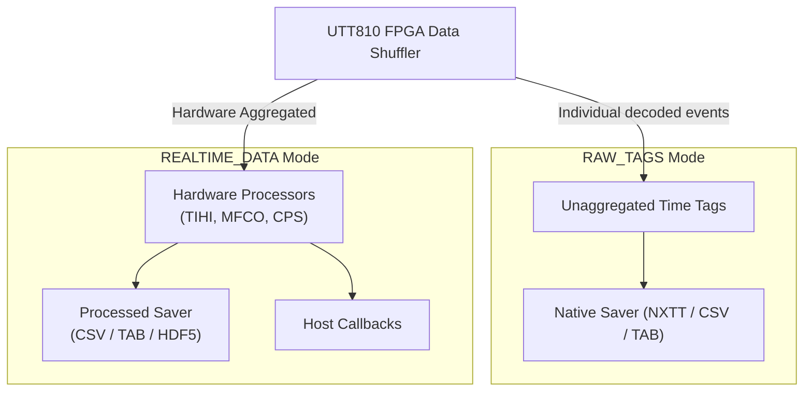
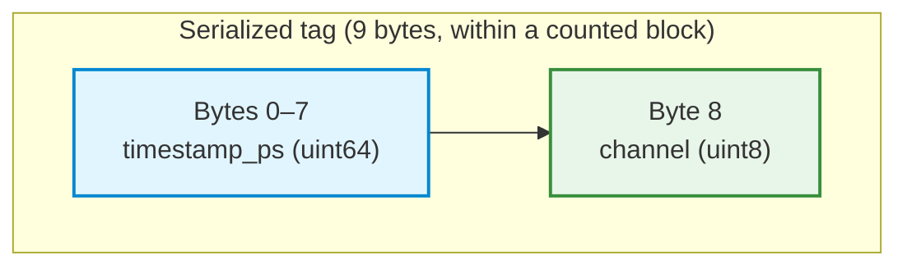

## File Saving and Data Export

The native file writer records data without sending each payload through Python or another client language. Choose the event or processed-data saver to match the selected hardware output mode. The diagram shows how native recording and application callbacks relate to those two workflows.

### [Raw time-tag file saving (`RAW_TAGS` mode)](6_1_file_saving_and_data_export.md#raw-time-tag-file-saving)

`NEXATOM_OUTPUT_RAW_TAGS` selects individual event output. Configure engines and output while the system is quiet; selecting a saver does not itself stop existing engines or begin capture. Native decodes the wire stream and writes timestamp/channel records without routing each event through Python. Check the active profile for supported output modes, including encoded-tag output where available. Throughput depends on event rate, USB transport and host storage; binary saving does not guarantee lossless operation at every rate.

The native file saver is configured via the `nexatom_time_tag_file_config_t` struct and enabled via `nexatom_tt_enable_time_tag_file_saving()`.

Choose `NEXATOM_TT_FILE_BINARY` for compact `.nxtt` data, `NEXATOM_TT_FILE_CSV` for comma-separated text, or `NEXATOM_TT_FILE_TAB` for tab-separated text. **The text files contain individual time tags**, with integer `timestamp_ps` and `channel` columns. They are distinct from processed histogram/count packets. Preserve integer picoseconds when loading a file; converting a large timestamp immediately to a floating-point second value can lose fine differences.

**File Rotation:**
To prevent single-file filesystem limits on long acquisitions, the native saver automatically rotates output files based on configured thresholds:
*   `max_file_size_mb`: File-size rotation threshold in megabytes; zero disables it.
*   `max_duration_minutes`: Triggers rotation based on elapsed wall-clock time.
*   `max_event_count`: Triggers rotation after a specific number of time tags.
*   `rotate_on_acquisition_boundary`: Forces a new file when a `start/stop` condition is triggered.

**Naming Convention:**
The SDK automatically generates sequentially numbered files using the following pattern:
`<base_prefix>[_timestamp]_TAGS_<sequence>[_suffix].<ext>`

Sequences are four-digit and one-based. Native may create date subdirectories, so inspect the generated directory tree instead of assuming the base filename is a single literal output file. Rotation is checked at writer boundaries and is not a guarantee of an exact byte/event cut.

### [Processed data file saving (`REALTIME_DATA` mode)](6_1_file_saving_and_data_export.md#processed-data-file-saving)

When the device output type is set to `NEXATOM_OUTPUT_REALTIME_DATA`, the native saver can persist the aggregated payload packets (CPS, TIHI, MFCO, CORM, CORL, TELM) to disk concurrently with callback dispatch.

This is enabled via `nexatom_tt_enable_processed_file_saving()` using `nexatom_processed_file_config_t`. Supported export formats include:
*   **HDF5:** The recommended binary format for complex hierarchical structures (like Multi-Tau correlation matrices and TIHI fit results).
*   **CSV / Tab-Separated:** Best for simple visual inspection of CPS and telemetry data.

Set options with `set_processed_file_config(packet_type, config)`, enable each required sink with `enable_processed_file_saving(packet_type, base_filename, format)`, then explicitly start the acquisition. Enabling time-tag saving disables processed saves, and enabling processed saving disables tag saves. Processed CSV/TAB and HDF5 cannot be mixed within one active saver configuration. HDF5 uses a session container rather than the per-packet text-file rotation limits.

Processed text timestamps use Unix epoch milliseconds. CPS channel values are already rates in Hz. TIHI contains bins and histogram settings; MFCO contains 256 pattern bins and its configuration/quality metadata; CORL/CORM contain lag/value pairs and normalization information. Keep that metadata with the numerical arrays.

Processed CSV and TAB files of one packet family carry the same `#` notes, heading row and values; only the delimiter and the schema line (for example `mfco_csv_v2` or `mfco_tab_v2`) differ. Standard CSV readers read them after skipping the `#` lines.

**Files from earlier SDKs:** preview.8 CORL and CORM CSV files contain unescaped JSON delimiters, so strict CSV readers reject those rows. Read them with their TAB or HDF5 counterparts. Do not repair a scientific record by silently dropping or splitting metadata. This never affected the individual time-tag CSV format.

Different packet families have different columns. Skip leading `#` preamble lines before using a CSV reader; do not parse with `line.split(',')`. Versioned MFCO CSV includes a quoted `metadata_json` field and the declared pattern count. Read its schema marker before interpreting columns. TAB contains tab-delimited fields and can include JSON metadata; parse the outer delimiters before decoding JSON.

For HDF5, inspect root `schema_version` and each dataset's columns, units and description attributes. Current files use root schema version 4 (`nexatomtt_pd_hdf5_v4`), one dataset per measurement type with the CSV headings as member names. MFCO from schema version 3 onward includes result-quality metadata; an older file without those fields has unknown quality, not zero errors. Specialized Fast TIHI index products require their own capability and schema; a `.csv` extension does not make their layout identical to CPS or TIHI.

### [NXTT binary file format](6_1_file_saving_and_data_export.md#nxtt-binary-file-format)

The `.nxtt` file is an uncompressed binary container for decoded time tags. It is not a dump of the USB wire framing and does not serialize the padded C/Python structures with `sizeof`.

**1. Serialized file header — 16 bytes**
Every `.nxtt` file begins with a standardized metadata header:
*   `magic` (4 bytes): ASCII `NXTT`, without a terminating NUL on disk.
*   `created_timestamp_us` (`uint64_t`): A 64-bit unsigned integer representing microseconds since the UNIX epoch.
*   `output_data_type` (`uint32_t`): Verifies the payload origin (matches `nexatom_output_data_type_t`).

> **Host structures and disk bytes differ.** The native reader returns an aligned `nexatom_time_tag_file_header_t` with a NUL-terminated magic field and padding for ABI access. Those extra bytes are not in the file. Integers on disk are little-endian. Prefer the supplied reader instead of reimplementing this codec.

**2. Data Payload (Record Layout)**
The header is followed by blocks. Each block begins with a little-endian `uint32` count, followed by that many packed tags. Each tag occupies **9 bytes**: an eight-byte timestamp and one-byte channel. A block count is framing, not a time tag.

*   **`timestamp_ps`**: Decoded hardware timestamp in picoseconds; not a Unix timestamp or a promise of a new zero origin for every host acquisition.
*   **`channel`**: Decoded event channel identifier. Interpret it using the active image/profile's channel mapping.
*   **Host padding:** The C/Python `NexatomTimeTag` representation is aligned and has padding. This padding is absent from the nine-byte on-disk tag.

### Finalizing and reviewing a capture

Follow the complete [raw-capture tutorial](../03_tutorials/3_4_raw_time_tag_capture_and_offline_csv_export.md) or processed template: stop/observe the intended measurement, quiet system output, finalize the active savers and check disconnect errors. `flush_immediately` requests file-manager flushing; it is not an acquisition-completion or durable-storage guarantee.

After cleanup, enumerate the files actually created, verify their headers and read at least one record from each requested packet family. A saver with no received data may not create a file immediately. Preserve any parsing failure alongside the original file instead of marking the capture successful merely because files are nonempty.
