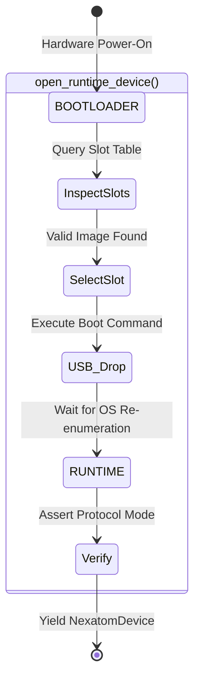

## Bootloader-First Device Startup

For maximum operational safety, NexatomTT hardware natively powers on into `BOOTLOADER` mode. This ensures the device remains recoverable even if a corrupted or incompatible firmware image resides in flash memory. Consequently, host applications must actively orchestrate the transition from `BOOTLOADER` to `RUNTIME` mode prior to configuring data acquisition.

### [`open_runtime_device()` context manager](6_6_bootloader_first_device_startup.md#context-manager)

The `nexatomtt.runtime_boot` Python module provides the `open_runtime_device()` context manager. This function completely abstracts the complex state machine required to safely inspect flash memory, boot a firmware image, and survive the subsequent USB bus disconnection.



**Usage:**
```python
from nexatomtt.runtime_boot import open_runtime_device, RuntimeBootOptions

options = RuntimeBootOptions(timeout_ms=10000)
with open_runtime_device(library, options) as device:
    device.enable_system(True) # Device is guaranteed to be in RUNTIME mode
```

### [Slot selection strategy](6_6_bootloader_first_device_startup.md#slot-selection-strategy)

The UTT810 hardware contains multiple isolated flash memory slots, allowing several firmware images to reside on the device simultaneously. When `open_runtime_device()` queries the hardware slot table, it selects the boot target using a strict priority cascade:

1.  **Preferred Slot:** If the user explicitly defines `options.preferred_slot`, the orchestrator attempts to boot it. If the slot is empty or corrupted, it fails immediately rather than falling back.
2.  **Default Slot:** If no preferred slot is specified, the orchestrator boots the slot currently marked as `default` in the hardware's non-volatile memory.
3.  **Lowest Valid Slot:** If no default is set, the orchestrator scans all slots and boots the lowest-indexed slot containing a valid, verified firmware image.

### [USB re-enumeration and identity matching](6_6_bootloader_first_device_startup.md#usb-re-enumeration-and-identity-matching)

When the device receives a boot command, the FPGA halts, the hardware drops off the USB bus, and the FTDI controller re-initializes. From the perspective of the host OS, the device has been physically unplugged and plugged back in.

If multiple NexatomTT devices are connected to the same host PC, the orchestrator must guarantee it reconnects to the *exact same physical unit* after re-enumeration. It utilizes the `DeviceIdentity` structure to achieve this:
*   **Primary Match:** `connection_id` (The physical USB port / topology path).
*   **Fallback Match:** `serial_number` (Unique hardware identifier).

The orchestrator polls the USB bus continuously until a device matching these identity parameters reappears in `RUNTIME` mode.

### [Error recovery and timeout configuration](6_6_bootloader_first_device_startup.md#error-recovery-and-timeout-configuration)

USB re-enumeration speeds vary drastically between operating systems (e.g., Windows may take up to 4 seconds to assign a driver to the re-enumerated endpoint). The `RuntimeBootOptions` dataclass provides granular timeout configurations to prevent infinite polling loops:

*   **`timeout_ms`**: The absolute maximum time allowance for the entire boot-and-reconnect sequence.
*   **`mode_timeout_sec`**: The maximum time to wait for the device to settle into the targeted protocol mode.
*   **`poll_sec`**: The sleep interval between device discovery attempts during the USB drop phase.

If the device fails to reach `RUNTIME` mode within the specified `timeout_ms`, or if the selected firmware slot throws a boot error, the orchestrator raises a `RuntimeBootError` and cleanly releases all intermediate handles.
