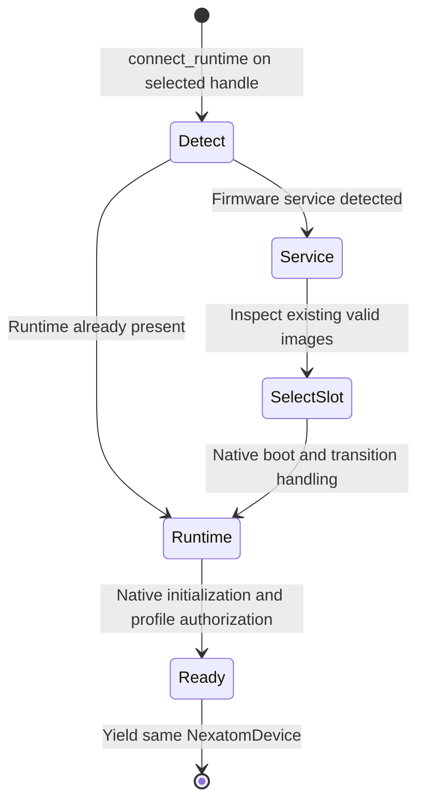

## Bootloader-First Device Startup

Bootloader-equipped NexatomTT hardware can start in firmware service (`BOOTLOADER`) mode before running its measurement image. Other supported devices may already be in runtime, including legacy Zynq hardware without a bootloader. Applications use the same native runtime-entry operation for measurement readiness rather than assuming one initial state from a product name.

The native API owns discovery, service/image boot transitions, initialization and profile resolution. The client selects an instrument and an intended measurement; ordinary startup requires no manual protocol or hardware-profile selection.

<a id="context-manager"></a>

### [`open_runtime_device()` context manager](6_6_bootloader_first_device_startup.md#context-manager)

The `nexatomtt.runtime_boot` module provides `open_runtime_device(library, device_info, options=...)`. Its default path calls native `connect_runtime()` on one created handle. Native boots an existing valid image if needed, waits for runtime/profile readiness and retains that same handle and its ownership.



**Usage:**
```python
from nexatomtt import NexatomLibrary, open_runtime_device, RuntimeBootOptions

library = NexatomLibrary(home="/path/to/extracted-sdk")
devices = library.discover_devices()
if len(devices) != 1:
    raise RuntimeError("Select one intended instrument before starting")

options = RuntimeBootOptions(timeout_ms=20000)
with open_runtime_device(library, devices[0], options=options) as device:
    # Ready for supported controls; connecting has not started a measurement.
    profile = device.get_device_profile()
    print("Available channels:", hex(profile.effective_public_tdc_mask))
    # Configure and acquire using the complete tutorial's explicit start/stop.
    device.disconnect()  # Check shutdown before context-manager destruction.
```

### [Slot selection strategy](6_6_bootloader_first_device_startup.md#slot-selection-strategy)

Bootloader-equipped devices expose their slot inventory. Use the reported slot count rather than assuming a fixed number of slots. When a service-mode boot is required, selection follows this priority:

1.  **Preferred Slot:** If the application explicitly defines `options.preferred_slot`, the helper requests that slot. If the slot is not VALID, selection fails rather than falling back.
2.  **Default Slot:** With no explicit preference, native boots the default slot when it is VALID.
3.  **Lowest Valid Slot:** If the default is absent or not valid, choose the lowest-indexed VALID slot.

An explicit `preferred_slot` is useful for deliberate firmware-service work. If the device is already in runtime, the helper completes readiness there; it does not force a boot of that slot. Ordinary runtime entry does not load an image, modify flash, or change the persistent default. Those are separate field-update operations.

### [USB re-enumeration and identity matching](6_6_bootloader_first_device_startup.md#usb-re-enumeration-and-identity-matching)

Boot changes the device's protocol and runtime state; it must not be treated as proof of measurement readiness merely because the boot command was acknowledged. Native waits for the required runtime evidence and handles the transition on the existing device handle. A physical USB re-enumeration is not a mandatory client-visible step on every model.

Keep the selected device's complete discovery record. The USB bridge serial identifies the physical unit independently of the model/image identity resolved by native. The `DeviceIdentity` helper remains available for describing selection records; normal applications do not implement a second discovery/reconnect loop around native runtime entry. Ordinary SDK use owns one selected instrument, even if discovery lists more than one.

Advanced firmware examples can deliberately close and reopen a device to prove that a later independent session works. That additional validation is distinct from the boot operation's same-handle readiness contract.

### [Error recovery and timeout configuration](6_6_bootloader_first_device_startup.md#error-recovery-and-timeout-configuration)

Cold startup can need more time than attachment to an existing runtime. `RuntimeBootOptions` retains the following settings:

*   **`timeout_ms`**: Budget passed to native startup. A value such as 20000 ms is suitable for allowing cold startup without an arbitrary client sleep.
*   **`mode_timeout_sec`** and **`poll_sec`**: Compatibility settings used only for protocol detection in the explicit preferred-slot workflow, not a normal Python USB discovery loop.

If startup times out, identity is unsupported, or no valid image exists, report the native exception or `RuntimeBootError` with its diagnostic message. Do not replace that failure with fixed-delay retries or manual protocol selection. Preserve cleanup errors as part of the outcome. See the [runtime/service tutorial](../03_tutorials/3_6_runtime_bootloader_handoff_validation.md) for deliberate return-to-service operations; they are separate from normal measurement entry.
